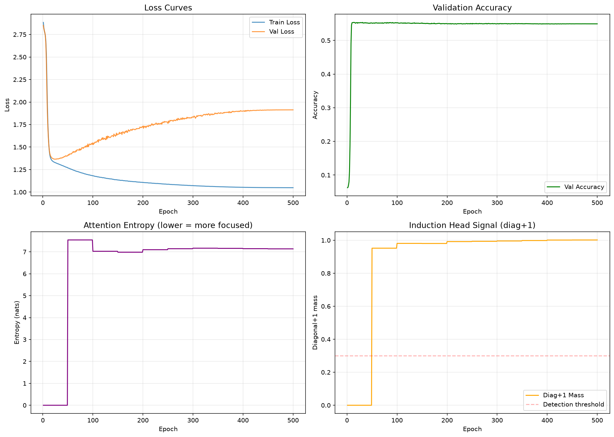

**Problem**: Detect and verify induction heads in a small 2-layer attention-only transformer trained on repeated random tokens. Induction heads implement the algorithm `[A][B]...[A] -> [B]` — they attend from the current token to its previous occurrence and copy the next token.

**Methodology**:
- Train 2-layer attention-only transformer on repeated random token sequences (Olsson et al. 2022)
- Identify induction heads via K-composition diagnostic (Nanda & Jacobsen 2023): L1 head composes with L0 duplicate-token head
- Verify causal role via head ablation and activation patching
- Track Step 1 (L0 duplicate mass) and Step 2 (K-composition) independently

**Key Result**:
<!-- manifest: results/exp1_induction_heads.json -->
Matched fixed-vs-fresh-batches comparison (800 epochs, identical config): fresh batches reach 52.2% val accuracy with no train/val gap, while the fixed reused dataset collapses to 0.05% val accuracy. Neither condition crosses the 0.3 induction-head detection threshold at this scale — 0/8 heads either way.

**Figure**:
 <!-- manifest: results/exp1_induction_heads.json -->

**Reproduce**: `uv run python -m src.experiments.exp1_induction_heads --quick` (smoke test) or `--standard` for the emergence-boundary run.

**Limitations**:
- Standard scale (d_model=64) may not reflect larger model dynamics
- Fresh-batches training prevents memorization but may slow induction emergence
- 0/8 heads at 3k epochs; 10k epoch run pending to find emergence boundary

**Links**:
- [[portfolio/RESULTS]] — my honesty ledger and per-rung numbers
- [[07_capstone/research-plan]] — where this rung sits in the experiment ladder
- [[04_nlp_and_transformers/notes/induction-heads]] — my full fixed-vs-fresh writeup

**Next Steps**:
- Complete 10k epoch run and document emergence boundary
- Run SAE on first confirmed head checkpoint (Rung 5 dependency)
- Test at larger scales (d_model=128, 256)
