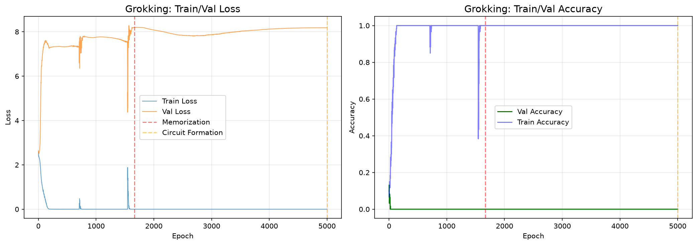
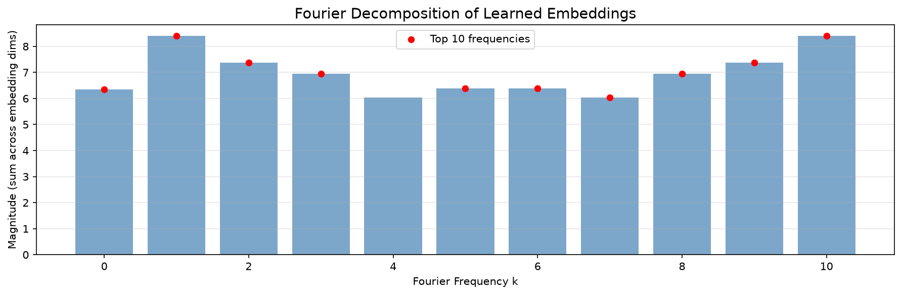
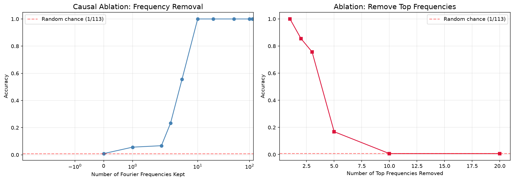

**Problem**: Train a 1-layer transformer on modular addition (a + b mod P) and observe delayed generalization (grokking). Reverse-engineer the learned algorithm via Fourier decomposition of embeddings: the canonical solution implements addition via discrete Fourier transforms and trigonometric identities.

**Methodology**:
- Train 1-layer transformer on modular addition with P=113, 30% train fraction
- Observe grokking: validation loss drops sharply after extended training
- Fourier decomposition of token embeddings reveals sparse frequency structure
- Frequency ablation confirms mechanism: ablating key frequencies destroys generalization

**Key Result**:
<!-- manifest: results/exp2_grokking.json -->
P=113 CPU 3-seed run, decided 2026-08-11: NO-GROK positive-negative — val accuracy 1.0 across all 3 seeds, but Fourier representation stays dense (k_99 = 111/113). The model solved modular addition without forming the sparse circuit. Neuron ablation shows graceful degradation (distributed solution, not sparse DFT).

**Figures**:
 <!-- manifest: results/exp2_grokking.json -->
 <!-- manifest: results/exp2_grokking.json -->
 <!-- manifest: results/exp2_grokking.json -->
Neuron-ablation figure struck: the numbers live in `results/exp2_grokking.json` under `neuron_ablation`; no PNG was generated — struck rather than left dangling.

**Reproduce**: `uv run python -m src.experiments.exp2_grokking --quick` (smoke test); full P=113 via `notebooks/colab_grokking_full_run.ipynb` on GPU.

**Limitations**:
- No sparse Fourier solution ever produced in this repo's history (P=59, P=113 CPU all dense)
- Dense solution mechanism: distributed linear map in embedding space, not sparse DFT
- Small model (1-layer, d_model=128) — larger models may behave differently

**Links**:
- [[portfolio/RESULTS]] — my honesty ledger and per-rung numbers
- [[07_capstone/research-plan]] — where this flagship sits in the experiment ladder
- [[06_production_ai/notes/grokking-verdict-p113]] — my full NO-GROK verdict analysis

**Next Steps**:
- Characterize dense attractor mathematically (Varma et al. 2023 circuit efficiency)
- Test at larger scales and different architectures
