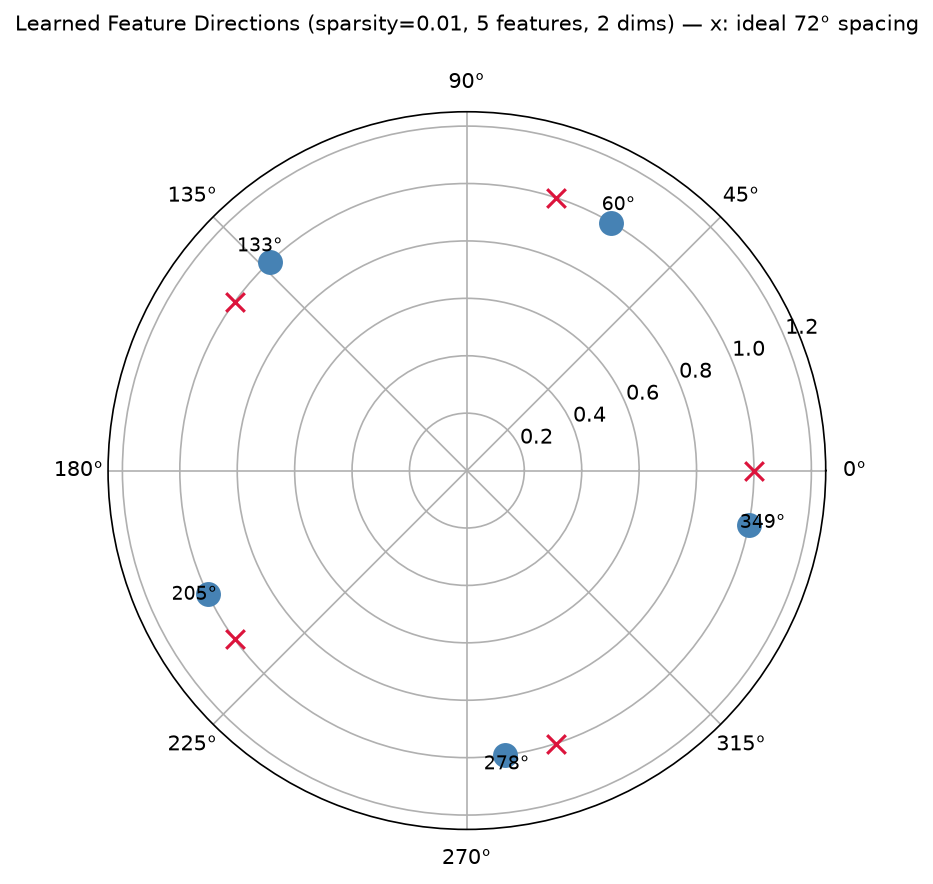

**Problem**: Study superposition — how neural networks represent more features than they have dimensions. Train toy autoencoders on synthetic data with known ground-truth feature geometry to validate interpretability methods.

**Methodology**:
- Generate synthetic data with sparse features (varying sparsity, importance decay)
- Train toy autoencoders with a real bottleneck (n_dimensions < n_features)
- Measure feature recovery: dimensionality, angular separation (pentagon geometry)
- Falsification tests: dense regime drops features, sparse regime represents all

**Key Result**:
<!-- manifest: results/exp3_superposition.json -->
Phase transition reproduced: 10/20 features represented at sparsity 0.5, rising to 20/20 by sparsity 0.05. Regular pentagon geometry (gaps 70.2–73.8 deg, std <= 1.4 deg vs ideal 72 deg) is the sparse-phase attractor at sparsity <= 0.1; the dense regime sits off-pentagon.

**Figure**:
 <!-- manifest: results/exp3_superposition.json -->

**Reproduce**: `uv run python -m src.experiments.exp3_superposition --quick` (smoke test) or `--geometry-check` for the pentagon drill.

**Limitations**:
- Synthetic data only — no real model activations yet
- Capacity limit at extreme sparsity (0.001): 14–16/20 features represented
- Pentagon geometry is a property of the *sparse phase*, not universal

**Links**:
- [[portfolio/RESULTS]] — my honesty ledger and per-rung numbers
- [[07_capstone/research-plan]] — where this rung sits in the experiment ladder
- [[05_llm_engineering/proofs/superposition-setup-validity]] — my root-cause reconstruction (the missing bottleneck)

**Next Steps**:
- SAE on real activations from confirmed induction head checkpoint (Rung 5)
- SAE on capstone model activations
- Scaling laws for dictionary size vs. feature recovery
