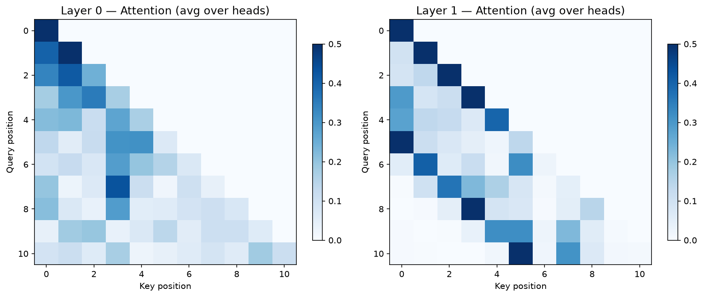
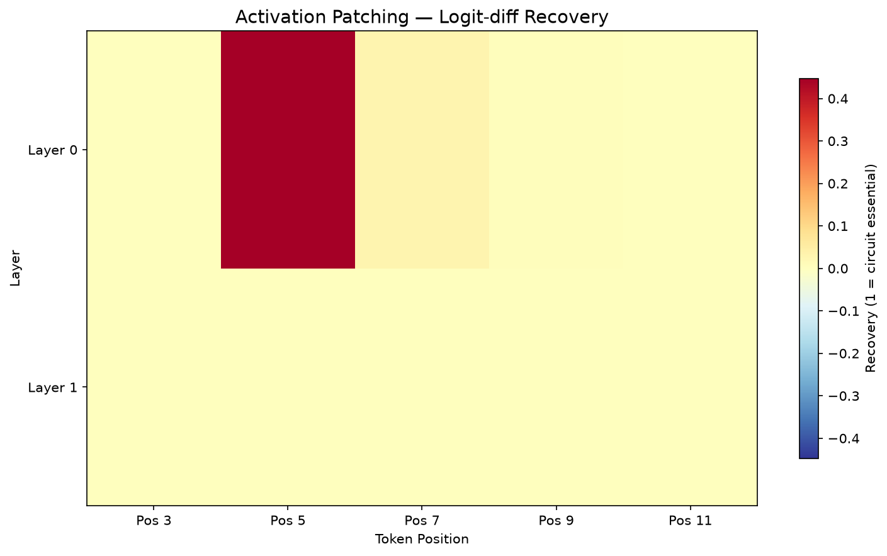

**Problem**: Discover and verify computational circuits in trained transformers using causal intervention methods: activation patching (swap activations between runs) and path patching (isolate specific pathways).

**Methodology**:
- Train models on induction and modular addition tasks
- Detect induction heads via K-composition diagnostic
- Activation patching: hook the block's `attn` output directly (post-W_O, the tensor that survives to the next layer), swapping `resid_mid` from a corrupted run
- Path patching: isolate a single head's direct effect on logits via per-head W_O column blocks
- Head ablation: `head_mask` zeroes a head's contribution before W_O

**Key Result**:
<!-- manifest: results/exp4_circuit_patching.json -->
Quick-mode 3-seed manifest: mean activation-patching recovery ~0.20 across 10 layer/position combos with 0/8 heads detected in all 3 seeds — a real, small, consistent circuit sensitivity, just not concentrated enough in one head to cross the 0.3 threshold. Head ablation and path patching skipped again (no head to target): path patching remains validated by unit tests only.

**Figures**:
 <!-- manifest: results/exp4_circuit_patching.json -->
 <!-- manifest: results/exp4_circuit_patching.json -->
Head-ablation figure struck: ablation is skipped whenever 0 heads are detected, so there is no result to plot — struck rather than left dangling.

**Reproduce**: `uv run python -m src.experiments.exp4_circuit_patching --quick` (smoke test) or `--quick --seeds 0,1,2` for the manifest config.

**Limitations**:
- Gated on Rung 1 producing confirmed induction heads (0/8 so far)
- No real circuit discovery yet — infrastructure ready, awaiting real heads

**Links**:
- [[portfolio/RESULTS]] — my honesty ledger and per-rung numbers
- [[07_capstone/research-plan]] — where this rung sits in the experiment ladder
- [[05_llm_engineering/proofs/intervention-validity]] — my patch-site and metric fix reconstruction

**Next Steps**:
- Run on first confirmed head checkpoint from Rung 1
- Run on capstone model checkpoints
- Extend to modular addition circuits (Fourier frequencies as circuits)
