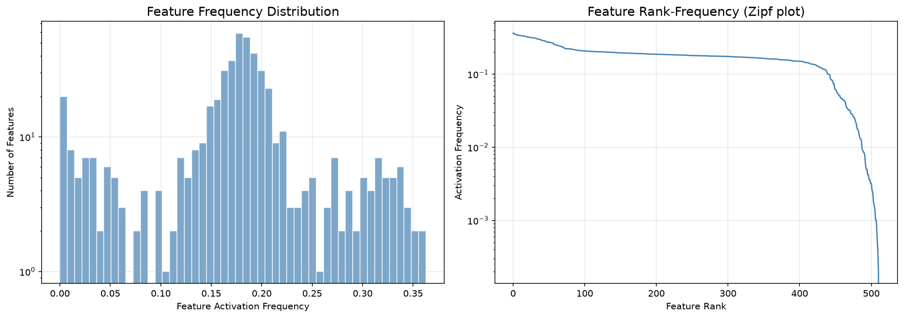
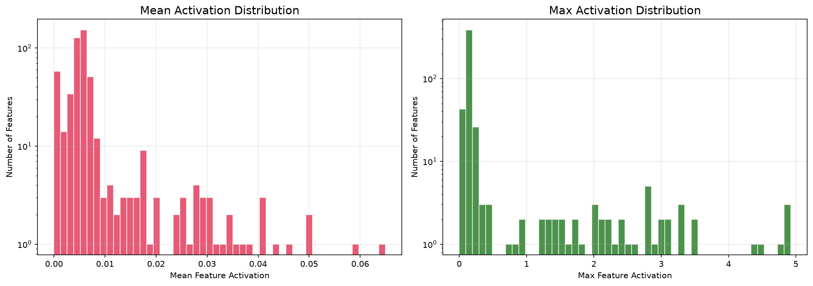

**Problem**: Extract interpretable features from trained transformer activations using Sparse Autoencoders (SAEs). Build an interactive dashboard for feature exploration.

**Methodology**:
- Train SAE on activations from trained models (synthetic + real)
- Harvest real activations from the `ln_final` hook (residual stream) via `--activations-from`
- SAE architecture: encoder + ReLU + decoder with pre-encoder bias (`x - b_dec`, Bricken et al.) and unit-norm constraint
- Metrics: Fraction of Variance Explained (FVE), L0 sparsity, dead features (fixed 1e-4 threshold)

**Key Result**:
<!-- manifest: results/exp5_sae_dashboard.json -->
Synthetic baseline (manifest-backed): FVE 0.9749, L0 96.6/512, 39/512 dead. Real-activation run (prose, plots never saved): 99.97% FVE but L0 136/256 (53% active) with 0 dead — reconstructs better but far less sparsely. Read honestly: a dense linear autoencoder on a small undertrained residual stream, not genuinely sparse interpretable features yet.

**Figures**:
 <!-- manifest: results/exp5_sae_dashboard.json -->
 <!-- manifest: results/exp5_sae_dashboard.json -->
Real-activation figures struck: the numbers came from a run whose plots were never saved — struck rather than left dangling.

**Reproduce**: `uv run python -m src.experiments.exp5_sae_dashboard --quick` (smoke test, synthetic).

**Limitations**:
- Sparsity gap: real model activations not sparse (L0=136 vs expected 20–30)
- Gated on Rung 1 producing confirmed induction heads for a meaningful real checkpoint
- Dictionary size (256) may be too small for real model capacity

**Links**:
- [[portfolio/RESULTS]] — my honesty ledger and per-rung numbers
- [[07_capstone/research-plan]] — where this rung sits in the experiment ladder
- [[02_classical_ml/proofs/trees-ensembles-pca]] — PCA as the conceptual ancestor of SAEs

**Next Steps**:
- SAE on first confirmed head checkpoint (gated on Rung 1)
- SAE on capstone model at multiple checkpoints
- Deploy interactive browser to HF Spaces (gated on a real head)
- Scaling: larger dictionary (1024+), more training steps
